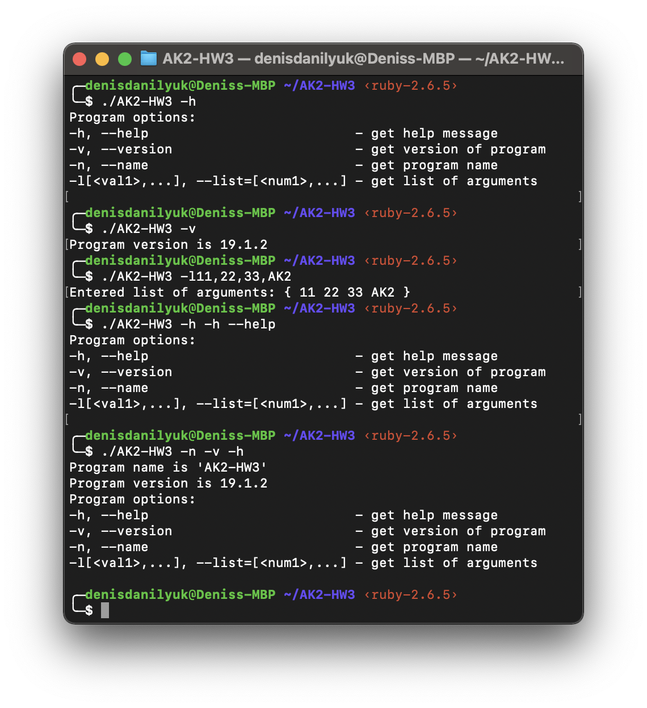

# AK2-HW3

#### Program options:

- -h, --help                            -> get help message
-	-v, --version                   		  -> get version of program
-	-n, --name                       		  -> get program name
-	-l[arg1,...], --list=[arg1,...]   -> get list of arguments

#### Program screenshots:

